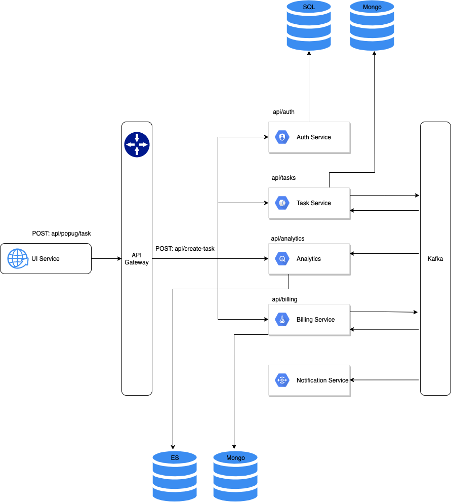

# aTES-UberPopug

## Service diagram

## Description of services

### UI Service

Сервис ответственный за UI, который позволяет взаимодействовать с пользователем.

HTTP transport, будет передаваться данные:

- User Credentials (клюв)
- User Data
- Task / Task State
- Report parameters

Failure:

Должен быть максимально легковесным и нагрузки тут никакой нет, кроме как сетевые проблемы.

### Gateway Service

Сервис позволяет определить весь API для клиента. Инкапсулирует внутренние сервисы.

Так же иногда позволяет с агрегировать несколько запросов.

HTTP transport(sync):

Перенаправляет данные во внутренние сервисы от клиента(ui service).

Failure:

Базы данных - нет

Могут быть ресурсные проблемы. Варианты решения , скейлинг, RateLimiter.

Если не доступный сервис какой-то, нужно сразу отправлять информацию о том что сейчас операция не доступна.

### **Task Service**

Сервис ответственный за создание задач, отслеживание статуса.

HTTP transport(sync) - inbound:

Запросы на создание задач (description/ assignment cost / ready cost)

Запрос о состоянии задач (state)

Запрос для инициации ассайнмента

Kafka transport inbound(async):

Данный о доступных пользователях

*Возможно нужно ассаймент ивент сделать Asyn и хранить его в очереди*

Failure:

База данных - можно использовать Failure сторедж например в кафка, в случаи недоступности сохранить в временно в кафка.
Но думаю лучше отправлять информацию о том что операция не доступна.

Для sync операций отправлять 500 ошибку

Для async что приходит из кафки можно будет переложить в Failure очередь, для повторной обработки

Можно сделать баз из 2-3х кластеров.

### Billing Service

Сервис ответственный за подсчет бюджета основываясь на информации из ТЗ и общих правил. Так же формирует выплаты в конце
месяца. Отслеживание статуса выплат/счета каждого сотрудника.

HTTP transport(sync) - inbound:

Таска началась, открыл счет на пользователя (task + user)

Таска окончена, подсчет всего счета

Сколько получил за день

Запрос информации (аудит лог + текущий баланс)

Kafka transport inbound(async):

- Данный о доступных пользователях
- Данный о задачах

Failure:

Смотри Task Service

### Analytics Service

Хранит всю информацию в Elasticsearch, который позволяет построить отчет любого типа. (например в Kibana можно все
отображать)

HTTP transport(sync) - inbound:

Запрос на получения отчета за какой то период (количество заработанных топ-менеджментом за сегодня денег + статистика по
дням)

Kafka transport inbound(async):

- Данный о доступных пользователях
- Данный о задачах
- Данный о биллинге

Failure:

Смотри Task Service

### Notification Service

Реализован по паттерну Pub/Sub, делает рассылку во внешние системы информации о статусах, о новых задачах.

Ответственный за задачу:

отправлять на почту сумму выплаты(дневную).

отправить информацию о выплате (в конце месяца)

Kafka transport inbound(async):

- Данный о задачах
- Данный о биллинге

### Kafka

Используется для асинхронной коммуникации внутри системы.